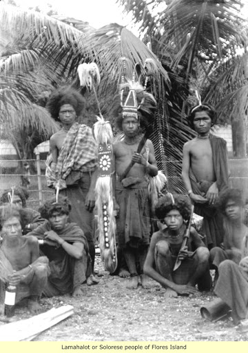

# Medical Geography Instructions for the Malay Archipelago
Doctor Rück, presently a physician in Sumatra, has honored the Anthropology
Society by requesting it to guide his studies on the Malay Archipelago, specifically
from the medical point of view.
 Charged with responding to his request to the Society, I am not afraid to state
that the situation of Doctor Rück enables us to await from him more than he will
receive from us. I shall nevertheless, by means of an outline that can be of service
to the original researches of our confrère, provide a summary of the current state of
our knowledge on this question.
 The Malay Archipelago, commonly called Malaysia, is comprised of the
islands of Sumatra, Java, Borneo, Timor, Flores Island, the Moluccas, the Celebes,
and the Philippines; these islands extend from 10° S. latitude to 19° N. latitude and
90° E. longitude to 128° E. longitude.

One therefore ought to expect to find in Malaysia the principal marks of the
intertropical pathology: heat and humidity, each contributing to assure the sudden
appearance of various maladies. It is important, however, to make allowance for
three conditions:
1. The insular topography;
2. Variations in altitude;
3. The seasons.
 Insular topography. – Thanks to the topography of the constituent parts of
Malaysia, the average temperature, although hot, does not exceed 30° C., whereas
much farther from the equator in continental India it rises up to 40° C.
 Variations in altitude. – One needs to know not to mix within the same
medical geography study the different parts of the Malay territory without taking
into account differences in altitude.
 Accordingly, and rightly so, Dutch researchers have divided Malaysia into
many zones with respect to altitude:
 A torrid zone, comprising land between sea level and an altitude of 2,000 feet,
presents in its lower part a temperature of 27° C. and in its upper part a temperature
of 23° C.; the quantity of water vapor is 20.25 grams per cubic meter. 
A temperate zone, from 2,000 to 4,500 feet, possesses an average temperature
of 23° C. at its base and 18° C. at its top; its humidity level is 15.7 grams water
vapor per cubic meter.
 A cool zone, ranging from 4,500 to 7,500 feet, averaging 13° C. at its highest
part, has a humidity level of 11 grams water vapor per cubic meter.
 A cold zone, existing from 7,500 feet to 10,000 feet, is characterized by both a
low average temperature of 8° C. and a low humidity level of .76 grams of water
vapor per cubic meter.
 Lastly, the seasons supply an important element of variability to the
intertropical pathology. When the sun is in the southern hemisphere, the wind
blows from the northwest, bringing about the wet monsoon (or bad monsoon).
When the sun is in the northern hemisphere, the wind blows from the east,
producing the dry monsoon (or good monsoon).
 It is nonetheless true that the torrid zone is the most extensive and that the
hygrometer reads .80 to .81 in the dry season, and .91 to .92 in the rainy season.
 Heat and humidity make Malaysia a land of fever, hepatitis, and dysentery.
Many writers, Armond among others, think that people have very much
exaggerated the insalubrity of Sumatra and Java. In Sumatra notably, if the west
coast is extremely unhealthy and has been justly been named the coast of
pestilence, the east coast will frequently present examples of great longevity.
 Nevertheless, torrential rains, frequently overflowing streams, luxuriant
vegetation that furnishes an abundance of detritus, and lastly constant warm
weather—all these contribute to supporting homes for and sources of malaria.
 But these malarious homes only become homes of intermittent fever for man.
Enormous pachyderms seem to find in these insalubrious surroundings particularly
favorable conditions of development. Man does not have this privilege, or at least,
if he has it, he has it more unequally; in other words, if the study of the climate of
Malaysia must precede any methodical study of the pathology of this region, one
can say as much for the study of another milieu, or the study of races.
 Doctor Rück, in the studies that he intends to make, ought therefore to not just
strive to construct a geographical map of maladies that allows for climatic or
seasonal variations, which would also be very useful to the science of colonization
and acclimatization; but, above all, he could render a great service to anthropology by sending us what can be called ethnologic maps of pathology.
 What is the pathology of Malaysia, and what is, throughout the Malay
Archipelago, the pathology of each race? Well, the races are numerous. One finds
here a veritable jumble of races that are today difficult for one to make a
distinction between, given that they are mixtures, confoundedly so up to a certain
point. 

